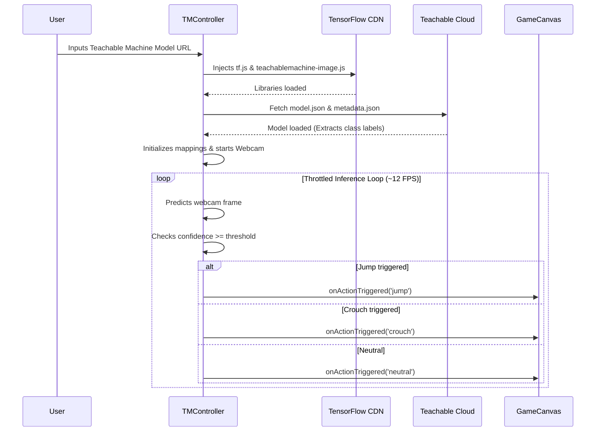

# 🤖 Agent Developer Guide: 8-Bit Motion Runner

Welcome, AI Agent! This document contains the blueprints, technical architecture, and coding standards for the **8-Bit Motion Runner** repository. Review this document to understand how to build, test, extend, and style the application.

---

## 📋 Table of Contents
1. [Project Overview](#-project-overview)
2. [Getting Started & Operations](#-getting-started--operations)
3. [Architecture Map](#-architecture-map)
4. [Teachable Machine Integration Flow](#-teachable-machine-integration-flow)
5. [Core Guidelines & Best Practices](#-core-guidelines--best-practices)
6. [Design System & Aesthetics](#-design-system--aesthetics)
7. [Future Extension Ideas](#-future-extension-ideas)

---

## 🌟 Project Overview

**8-Bit Motion Runner** is an interactive, retro-themed endless runner game built in React, TypeScript, and HTML5 Canvas. The defining feature of this application is its direct integration with **Google Teachable Machine (TM)**, allowing users to train physical webcam gestures (e.g., jumping, crouching) and use them to control the runner in real time.

### Key Features
- **HTML5 Canvas Endless Runner**: Frame-rate independent physics, obstacle generation, coin gathering, dynamic parallax backgrounds (mountains, clouds, stars), and Day/Night cycle transitions.
- **Teachable Machine Integration**: Dynamic loading of TensorFlow.js and TM Image SDK via CDN. Custom shared model URL input, live classification meters, customizable confidence thresholds, and dynamic action mapping.
- **Webcam Interface**: Real-time camera capture with self-scale scaling, mirror view, and stream controls.
- **Hardware Emulator Console**: Built-in simulator that allows testing and playing without requiring a webcam or loaded ML model.
- **Sound Effects Synthesizer**: Custom retro synthesized audio effects for jumps, crouches, coins, and game over.

---

## ⚙️ Getting Started & Operations

Use the following commands to operate the project environment:

- **Install Dependencies**:
  ```bash
  npm install
  ```
- **Run Development Server**:
  ```bash
  npm run dev
  ```
  *(Launches the app on `http://localhost:3000`)*
- **Build Production Bundle**:
  ```bash
  npm run build
  ```
- **Type Checking (Lint)**:
  ```bash
  npm run lint
  ```
- **Clean Build Outputs**:
  ```bash
  npm run clean
  ```

---

## 🗺️ Architecture Map

Below is a breakdown of the key files in the repository:

### 1. Main Entrypoint & Layout
* **[src/App.tsx](file:///c:/Users/chris/OneDrive/Desktop/Valenzuela/motion-runner/src/App.tsx)**: Main layout coordinator. Renders the retro headers, the instruction panel, and connects the webcam controller (`TMController`) to the canvas gameplay viewport (`GameCanvas`).

### 2. Components
* **[src/components/GameCanvas.tsx](file:///c:/Users/chris/OneDrive/Desktop/Valenzuela/motion-runner/src/components/GameCanvas.tsx)**:
  - Contains the canvas rendering loop (`tick()`) driven by `requestAnimationFrame`.
  - Implements AABB physics, gravity, jumping, crouch animations, and particle explosions.
  - Manages environment generation (parallax mountains, scrolling clouds, twinkling stars, and day/night transitions).
  - **Performance Optimization**: Stores game variables in `stateRef` (mutable reference) instead of React state to prevent heavy frame-rate lag. Synchronizes stats to React state only once every 10 frames.
* **[src/components/TMController.tsx](file:///c:/Users/chris/OneDrive/Desktop/Valenzuela/motion-runner/src/components/TMController.tsx)**:
  - Handles dynamic script injections for TensorFlow.js (`tf.min.js`) and TM Image SDK (`teachablemachine-image.min.js`).
  - Manages the webcam media streams (`navigator.mediaDevices.getUserMedia`) and handles camera permissions.
  - Manages the model sync logic, threshold adjustment sliders, active mappings, and parses classification results.
  - Runs predictions on a throttled loop (~12 fps/80ms delay) to conserve CPU cycles in browser runtimes.
  - Renders the fallback Emulator Simulator console for offline or camera-free testing.

### 3. Utilities & Types
* **[src/types.ts](file:///c:/Users/chris/OneDrive/Desktop/Valenzuela/motion-runner/src/types.ts)**: Declares typescript definitions for game configs, player states, obstacle types, particle objects, cloud/star positions, and machine learning structures (`ClassMapping`, `PredictionResult`, `TMModelInfo`).
* **[src/utils/sprites.ts](file:///c:/Users/chris/OneDrive/Desktop/Valenzuela/motion-runner/src/utils/sprites.ts)**: Implements pixel-art drawings using custom coordinates matrices for dino movements, obstacles, coins, and mountains.
* **[src/utils/audio.ts](file:///c:/Users/chris/OneDrive/Desktop/Valenzuela/motion-runner/src/utils/audio.ts)**: Manages synthesized web audio loops and sound triggers (jump, crouch, coin collect, and crash) to provide retro sound output.

---

## 🧠 Teachable Machine Integration Flow



### Action Configuration Mappings
By default, the model attempts to map loaded class names containing:
- `jump`, `up`, `high`, `fly` ➡️ **Jump**
- `crouch`, `down`, `duck`, `low` ➡️ **Crouch**
- All other values default to **neutral** (normal running) unless re-configured in the settings panel.

---

## 🛠️ Core Guidelines & Best Practices

When writing code or adding features to this repository, adhere to the following rules:

1. **Avoid React Rendering In Canvas Loop**: Never update React states inside every frame tick of `GameCanvas.tsx`. Doing so triggers React DOM diffing and causes stuttering. Utilize `stateRef` for active parameters and throttle React updates.
2. **Handle Webcam and API Errors Gracefully**: Check for webcam rejection errors (`NotAllowedError`, device busy) and present helpful fallback instructions. Ensure the Emulator is accessible at all times if camera streams fail to start.
3. **Throttled Inference**: Run TensorFlow predictions on a throttled loop (e.g. `80ms` delay). Running inference on every `requestAnimationFrame` frame tick will trigger heavy CPU usage and lag the UI.
4. **AABB Padding**: Use reasonable pixel padding when computing AABB collisions (`checkAABBCollision`) to ensure responsive gameplay. Coins should have generous hitboxes, while obstacles should have slightly tighter hitboxes to prevent frustrating "near miss" crashes.

---

## 🎨 Design System & Aesthetics

Keep all UI layouts aligned with the premium retro 8-bit theme:
- **Borders & Outlines**: Use thick, clean black borders (`border-4 border-black` or `border-8 border-black`).
- **Shadows**: Implement crisp, solid retro drop-shadows (e.g., `shadow-[4px_4px_0px_0px_rgba(0,0,0,1)]` or `shadow-[8px_8px_0px_0px_rgba(0,0,0,1)]`).
- **Animations**: Use snappy, retro-feeling transitions. Buttons should translate down and right when hovered or active: `hover:translate-x-0.5 hover:translate-y-0.5 hover:shadow-none transition-all`.
- **Typography**: Utilize monospaced font families for scores, indicators, and headers (`font-mono`, uppercase text).
- **Color Palette**:
  - Main Red: `#FF4D4D` (Primary Header Accent)
  - Golden Yellow: `#FFCC00` (Tutorials & Guide background)
  - Cyan Blue: `#00D1FF` (Emulator Console panels)
  - Emerald Green: `#00A86B` / `#00FF41` (Success labels, Live status)
  - Night Theme Sky: `#2e3440`
  - Night Theme Ground: `#4c566a`

---

## 🚀 Future Extension Ideas

Looking for tasks to implement? Here are some features that fit right in:
- **Powerups**: Implement a shield powerup (protecting against one collision) or a double-multiplier powerup for coins.
- **Difficulty Settings**: Add speed sliders or custom gravity adjustments.
- **Inference Smoothing**: Implement a simple prediction filter (e.g., voting buffer) to prevent flickering classification outputs from executing rapid, jerky actions.
- **Keyboard Remapping Dialog**: Allow users to customize standard keyboard control bindings (e.g., mapping crouch to `Shift` or `S`).
